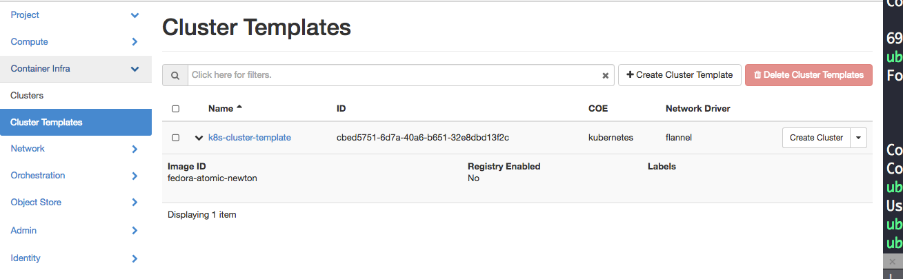

# Magnum Dashboard
在 OpenStack Liberty 版本中，Magnum 已成為正式釋出第一個版本，因此 Magnum 也開始整合於 OpenStack Dashboard 上，本章節就是安裝該 UI 套件。

### 安裝 Magnum Dashboard
由於 Magnum UI 目前還沒有相關 .deb 安裝來源，因此需要使用原始碼來安裝，透過 Git 來取得：
```sh
$ sudo git clone https://github.com/openstack/magnum-ui /opt/magnum-ui -b stable/newton
$ sudo chown -R ${USER}:${USER} /opt/magnum-ui
$ cd /opt/ && sudo pip install -e magnum-ui/
```

將 Magnum UI 相關程式檔案複製到 Horizon:
```sh
$ cd /usr/share/openstack-dashboard
$ sudo cp /opt/magnum-ui/magnum_ui/enabled/_1370_project_container_infra_panel_group.py openstack_dashboard/local/enabled
$ sudo cp /opt/magnum-ui/magnum_ui/enabled/_1371_project_container_infra_clusters_panel.py openstack_dashboard/local/enabled
$ sudo cp /opt/magnum-ui/magnum_ui/enabled/_1372_project_container_infra_cluster_templates_panel.py openstack_dashboard/local/enabled
```

完成後讓 Django 進行 collectstatic 與 compress：
```sh
$ sudo ./manage.py collectstatic
$ sudo ./manage.py compress
```

完成後可以重新啟動 Apache2 :
```sh
$ sudo service apache2 restart
```


